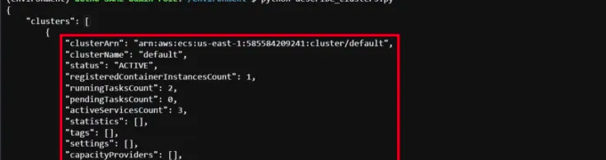
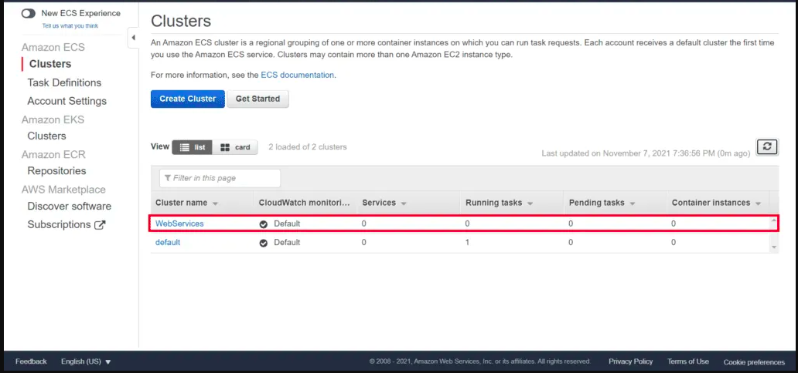

# DESCRIPTION

This template shows how to describe and list Cluster in ECS using the Boto3.

---

#### Prerequisite

* Install Python
* AWS Configure

---

### Steps

1. Open the folder in your terminal or any supported tool.
2. Run the following commands:

`python3 describe-cluster-boto3.py`

`python3 list-cluster-boto3.py`

---

### Outputs

<b>Describe Cluster

List Cluster</b>

---
